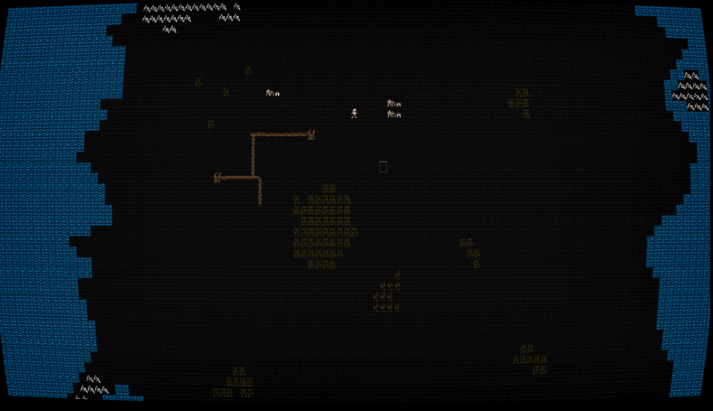
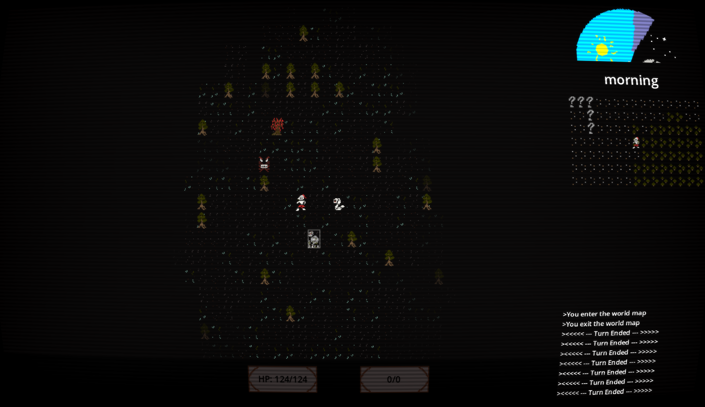

# [Placeholder Title]

  
*A traditional roguelike of exploration, survival, and discovery.*

---

## Overview  
**A Handcrafted Roguelike Adventure**  
Dive into a vast world filled with not many stuff for now. Built in **Godot Engine** using **GDScript**,  a classic turn-based roguelike gameplay featuring a sprawling open world and procedural generation with premade aspects.


---

## Features

### Expansive Open World  
- Explore a massive map with over 5000 `maps` to explore
- Handcrafted landmarks alongside procedurally generated terrain. (not implemented)

  

### Hybrid World Generation  
- A blend of **premade content** (key story locations, some dungeons) and **procedural generation** (terrain, loot, enemies) ensures no two playthroughs are the same.  

### Strategic Combat & Crafting  
- Battle monstrous foes with tactical turn-based combat.  
- Study enemies to **learn weaknesses** and harvest rare materials from their remains. (not implemented)
- Forge powerful gear using harvested parts, by finding skilled blacksmiths. (not implemented)

  

### Rich Handmade Lore  
- No lore implemented yet 

---

## Installation  
1. **Clone the repository**:  
   ```bash  
   git clone https://github.com/TopHattOwl/basic_rogue.git  